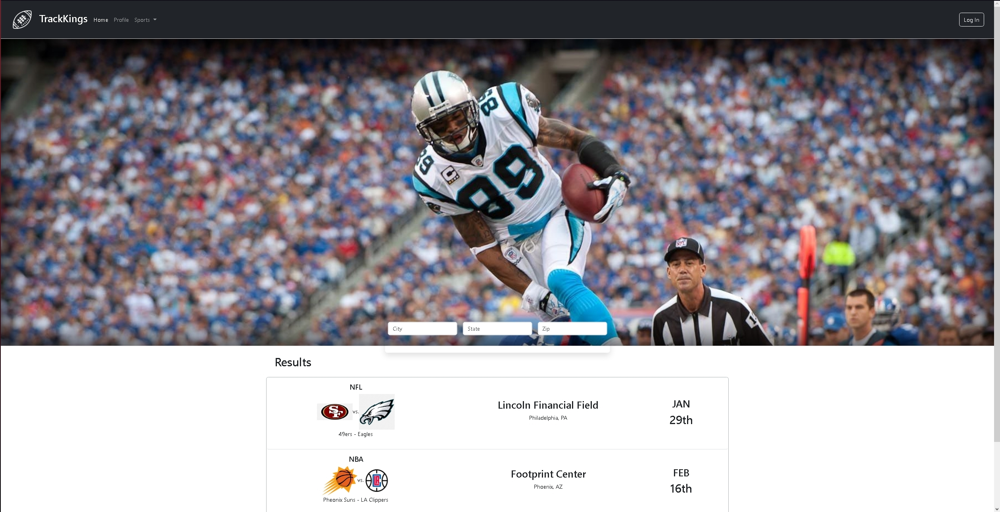
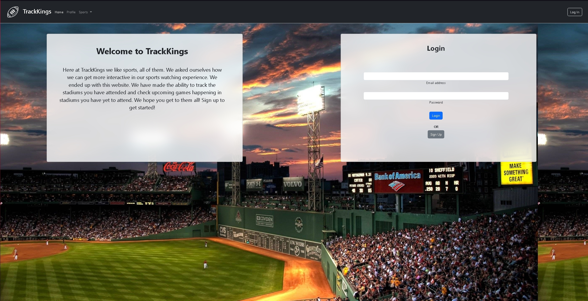
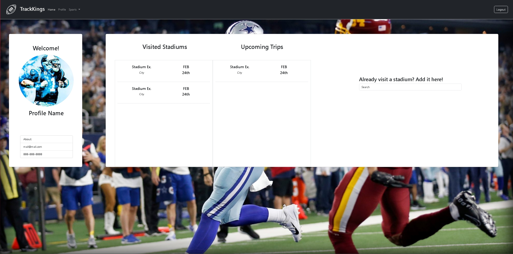

# TraKKings
---
Concept
* A stadium tracker, which tracks and logs the stadiums that you and the events that you attended
The super bowl was this past weekend !
The user is an avid sports fan that likes to attend NFL games, and would like to visit every stadium. They want to document the number of stadiums they have been to and find events for the stadiums that they haven’t.

# Resources
---
* Express
* Json
* mySQL and Sequelize
* Bootstrap
* Jquery
# Screenshots
---

# Links
---
- Heroku: 
    https://murmuring-atoll-53515.herokuapp.com/
- Github:
    https://github.com/TrentLe/Stadiums
- Googleslides:
    https://docs.google.com/presentation/d/1XpF_zKzpb1GM4Ukre68Dkg3ynG5R-JT0VzdlcM80saY/edit?usp=sharing